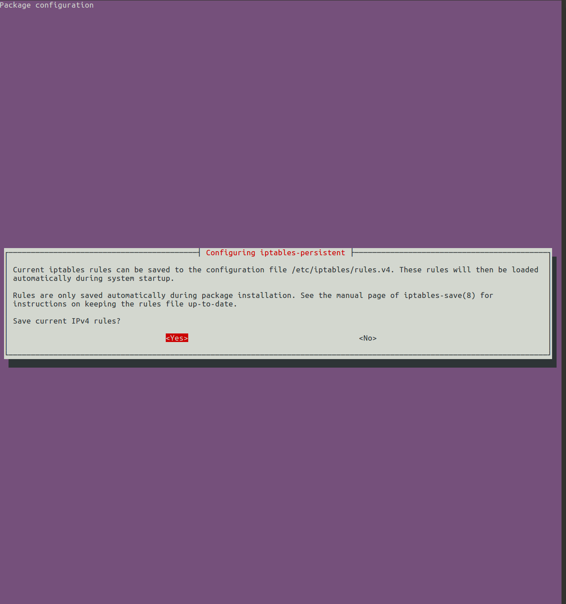
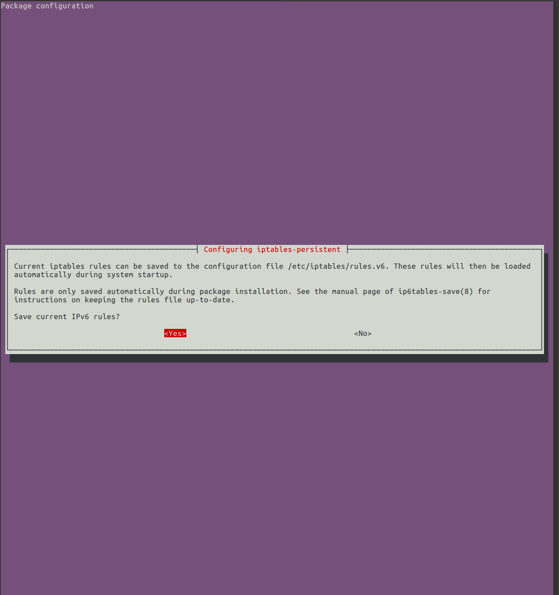
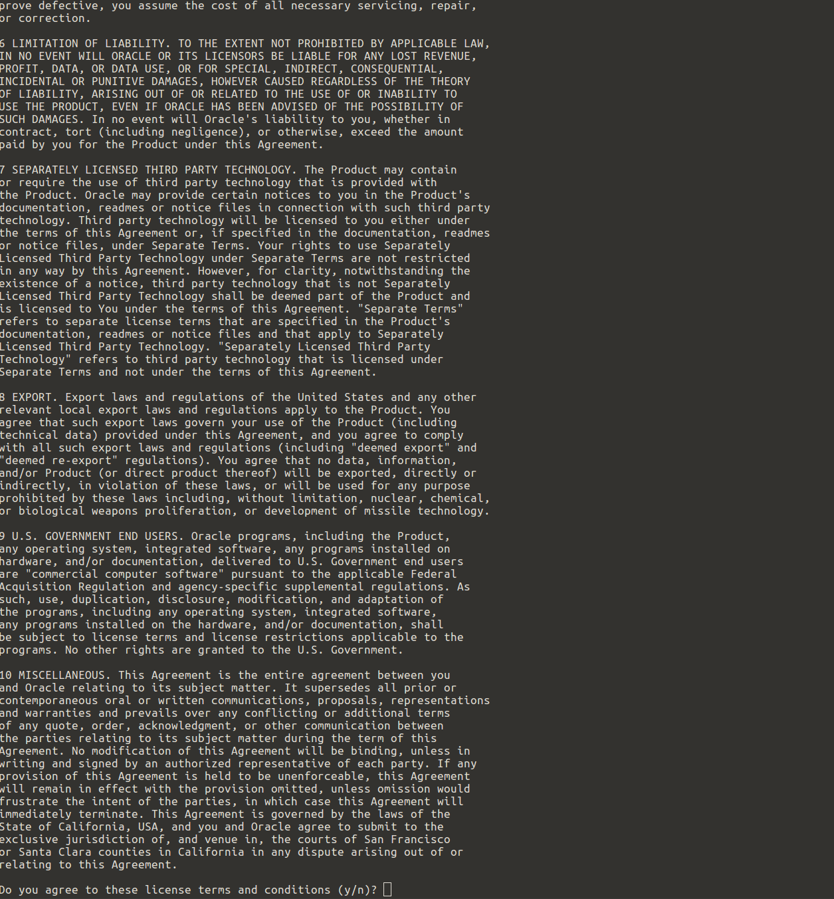

# Phoenix Cuckoo
#### Installing the Phoenix version of Cuckoo
#### Read this all the way through before
#### Consider this a 'quickstart' guide, as there are dozens of ways to deploy and configure Cuckoo/Phoenix
#### This readme will walk you through installing the main components required by Phoenix Cuckoo to operate:

* cuckoo
* docker
* django admin
* elasticsearch
* openvpn
* moloch
* mongodb
* mysql
* suricata
* virtualbox
* yara


##### 1. Move the code on to your system
```bash 
    git clone https://github.com/SparkITSolutions/cuckoo.git /opt/phoenix
```

##### 2. Copy over your openvpn profiles
Make sure you can login to your openvpn nodes from the command line with the configs before installing them with phoenix.  The configs will end up in /etc/openvpn/ on the installed system.
```bash
scp user@host:~/install/openvpn/* /opt/phoenix/install/openvpn/
```


##### 3. Copy VirtualBox OVA files
By default the `install/ubuntu_install.sh` file will take OVA files which have been dropped in the install/virtualbox folder and install them.  
```bash
scp user@host:~/*.ova /opt/phoenix/install/virtualbox/
```

#### OR

##### Import existing vms with snapshots
If you already have VMs setup you can import them by copying the entire folder over to your cuckoo user's virtualbox folder (typically `/home/cuckoo/VirtualBox\ VMs/`)and running 
```bash
vboxmanage registervm /full/path/to/vm.box
```

#### 4. Stop and edit install/ubuntu_install.sh lines 70 - 100
###### That's where all your DB, username and password configuration info lives for the install
```bash
vim /opt/phoenix/install/ubuntu_install.sh +70
```

##### 5. Jump to your install dir
```bash
cd /opt/phoenix/install
```

##### 6. Start your install
```bash
bash ubuntu_install.sh
```

##### 7. Accept default for iptables (we're going to configure that later)




##### Installs take time
Get a coffee, this takes a bit (3-5 min)

##### 8. Accept VirtualBox EULA


##### 9. Setup cuckoo OS user
Enter cuckoo user password when prompted

##### 10. Set up TLS Certificate
Enter certificate details when prompted 

##### 11. Setup your moloch install
* Type in `vboxnet0` for your vmnetwork (configurable in `ubuntu_install.sh` pre install)
* Type `No` don't install ES
* Type in your `docker Elasticsearch address` (default `http://172.18.1.253:9200`)
* Type in a `longNonsensePassword123`

##### OVAs get installed now.

VirtualBox OVA copy and import takes time.  Get more coffee...

##### 12. Fill in django admin credentials
This is the user which will create and manage trust groups within Phoenix Web UI

##### `ubuntu_install.sh` will exit now but a few steps remain

#### Setup your cuckoo guest
##### **This is better done on another machine and simply having vbox files imported
#TODO Add support for deploying pre saved vbox images

##### 13. Setup and take a clean snapshot of your VMs so cuckoo can interact
###### Startup your VM

```bash
su - cuckoo
vboxmanage modifyvm win7-x86-0 --vrde on
vboxmanage modifyvm win7-x86-0 --vrdeaddress 127.0.0.1
vboxmanage modifyvm win7-x86-0 --vrdeport 3389
vboxheadless -v on -e authType=NULL -s win7-x86-0
```
You can now RDP to 127.0.0.1:3389 on your Phoenix system to configure the guest OS

Something like this would forward that locally to you
```bash
ssh -fnNL 3389:127.0.0.1:3389 user@phoenix
```

#### Setup your VM from the guest, with python agent and office, etc.
##### 14. Once done, take your clean snapshot and you're ready for cuckoo
```bash
vboxmanage snapshot win7-x86-0 take clean
```


#### 15. Restart everything
```bash
/opt/phoenix/utils/crontab/root/cuckoo_full_restart.sh
```

#### It should look something like this

```
Stopping cuckoorooter:
Shutting down rooter.py: Stopping cuckoop:
Shutting down process.py:
Stopping cuckood:
Shutting down cuckoo.py:
Stopping cuckooweb:
Shutting down manage.py:
Stopping cuckooapi:
Shutting down api.py:
[ ok ] Stopping openvpn (via systemctl): openvpn.service.
[ ok ] Restarting fail2ban (via systemctl): fail2ban.service.
[ ok ] Starting openvpn (via systemctl): openvpn.service.
Starting cuckoorooter:
Starting rooter.py: Starting cuckoop:
Starting process.py:
Starting cuckood:
Starting cuckoo.py:
Starting cuckooweb:
Starting manage.py:
Starting cuckooapi:
Starting api.py:
```

#### 16. Check things
```
/etc/init.d/cuckoo_all status
```

##### If all went well you should see this
```
cuckoorooter is running
cuckoop is running
cuckood is running
cuckooweb is running
cuckooapi is running
```

##### You should be able to login as your django admin user on `https://your.cuckoo.host` to setup users and groups


### GOTCHAS:
* This is meant to act as a guide to install cuckoo components.  There might be bugs based on the OS you're installing, and dozens of other variables.  If there are, please let us know.  This was tested on Ubuntu 16.04 non-HWE.
* New users need to be added to both the django web interface (https://phoenix-host/admin) and the moloch interface (https://phoenix-host:8005/users) and they must be the same name (though passwords can and should differ).  In moloch, the moloch username and password are used for authentication, but the django database is used for authorization (that's where the TLP resides)
* Sometimes there are install issues if your system already has the yara python package installed.
  * This package from the requirements.txt should get you a functioning version for cuckoo: `yara-python==3.7.0`
* If you have imported your VMs already, remember to edit `conf/virtualbox.conf` before bouncing services
* If you run the install again, it will clobber the `conf/virtualbox.conf`, you'll need to set it up again #TODO - fix that
* If there are issues on install regarding the django setup, it's probably because there were issues connecting to your VPNs, and VPN connectivity is required to start the cuckoo web interface.  If this happens, fix your openvpn config and then re run these 2 commands:
  * python ../web/manage.py migrate
  * python ../web/manage.py createsuperuser

### Pro Tips:
* We haven't seen any issues using chrome, so I'd advise using that browser with Cuckoo/Phoenix
* If you port forward to port 19999 on this system, you have netdata installed so you can start playing around with finding bottlenecks and monitoring health
* There are some additional configurations you can enable to make cuckoo use other (larger/faster) mounts if you have those on your systems.  Read through the comments in ubuntu_installer.sh
* For now, iptables logs aren't being routed anywhere by rsyslog.conf, so you can find them in /var/log/syslog
* To update the code from github, simply run update_cuckoo.sh from the root of your cuckoo folder (in our example /opt/phoenix).  *** We recommend you backup before you run this ***

### See Phoenix in action

#### Take a look at Phoenix in our recent presentation at ACoD in Austin

[Phoenix Presentation](https://docs.google.com/presentation/d/1Esvck465UX2REGijGnZtS6_GugstS5NIJC2uvO2g0C0/edit?usp=sharing)

###### We would like to see these changes forked back to the main branch and will be working with the Cuckoo developers to merge our changes


In three words, [Cuckoo Sandbox](http://www.cuckoosandbox.org) is a malware analysis system.

What does that mean? It simply means that you can throw any suspicious file at it and in a matter of seconds Cuckoo will provide you back some detailed results outlining what such file did when executed inside an isolated environment.

If you want to contribute to development, please read [this](http://www.cuckoosandbox.org/development.html) and [this](http://www.cuckoofoundation.org/contribute.html) first. Make sure you check our Issues and Pull Requests and that you join our IRC channel.

